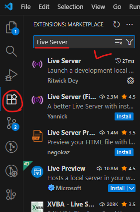
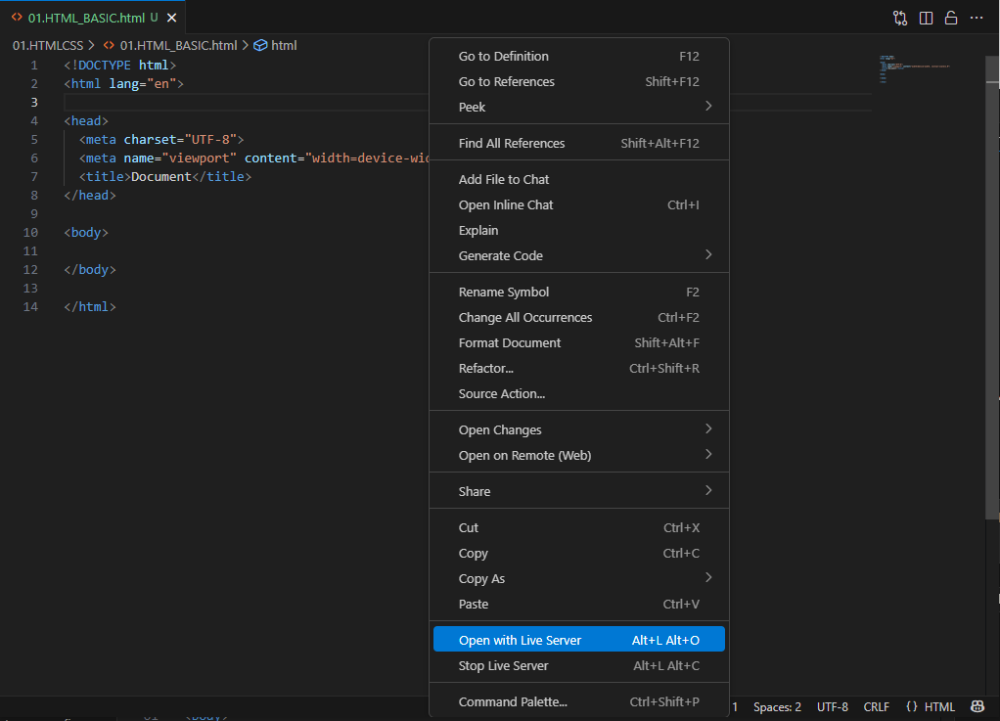
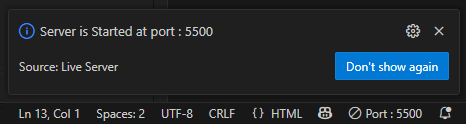
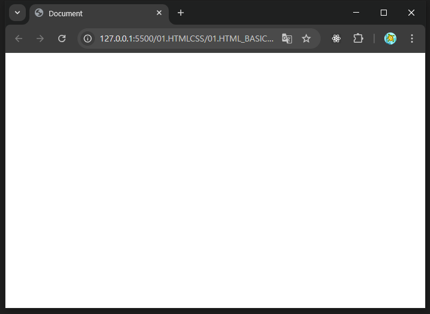

# 웹 크롤링
<details>
<summary>접기/펼치기</summary>
<br>

웹사이트에 있는 정보를 자동으로 빠르게 수집하는 것
WWW 월드 와이드 웹에서 웹과 크롤링이 합쳐진 단어이다.
웹(거미줄) + 크롤링(뛰어나다)
웹사이트들은 하이퍼링크를 통해 서로서로 연결되어있다.  
이 모습이 마치 거미줄같다고 해서 웹이라고 부른다.  
그리고 거미가 거미줄을 기어다니며 정보를 수집한다고 해서 크롤러를 거미에 비유한다.

웹 스크래핑 이라는 단어와 혼용해서 사용하며, 스크래핑은 긁어모으다 라는 뜻을 가지고 있으며 뉘앙스는 다르나 거의 같은 뜻이라고 보면 된다.  

## 웹 크롤링의 활용
1. 데이터 분석 과정  
데이터분석: 대량의 데이터로 유의미한 인사이트를 얻는 것  
데이터분석의 시작을 웹 크롤링이 담당한다.  
2. 웹사이트 자동화  
특정 페이지를 분석하고 자동화 프로그램을 만드는데 웹 크롤링 기술을 핵심적으로 활용  
3. 인공지능 학습 데이터  
예를들어 사용자가 특정 동물 사진을 보여주었을 때 무슨 동물인지 알려주는 인공지능 서비스 개발을 가정한다면  
동물 사진이 수천, 수십만장이 필요할 것이며 이는 사람이 쉽게 저장할 수 없는 양이다.  
웹 크롤링을 이용하면 이미지도 쉽게 수집할 수 있다.

## 웹 크롤링 주요 활용 사례
- 상품, 컨텐츠, 자동 업로드: 주로 온라인 사업자들이 사용
- 부동산 주식 재태크 데이터 수집
- 인스타그램, 유투브 모니터링 및 분석
- 뉴스 데이터 수집
- 논문, 구인공고 데이터 수집
  
### 웹 페이지를 어떻게 볼 수 있을까?
내부적으로 HTTP 통신이라는 것이 일어나기 때문에 웹페이지를 볼 수 있게 되는것이다.  
#### HTTP 통신
브라우저와 웹 서버 사이에 데이터를 주고 받는데 사용되는 통신을 말한다.  
- 웹 브라우저: 크롬 엣지 사파리 등
- 웹 서버: 웹 사이트에 대한 정보를 제공하는 서버

#### 요청과 응답
1. 사용자가 특정 페이지를 보기 위해 URL 주소를 웹서버에 요청한다.
2. URL 주소에 해당하는 페이지가 웹서버에 존재한다면 HTML로 사용자에게 응답해준다.  
   (HTML: 페이지에 대한 정보가 들어있음.)
   만약 해당 URL 주소가 웹서버에 존재하지 않는다면 서버는 404 Not Found라는 응답을 돌려준다.

### 웹크롤링 필요 기본 기술
1. HTML 기초
2. CSS 선택자
</details>
<br>

# VSC HTML 기본 템플릿 및 실행 가이드
<details>
<summary>접기/펼치기</summary>
<br>

## HTML 생성 및 기본 템플릿 생성
.html 확장자 파일 생성 후 ! + tab 실행시 아래 기본템플릿 코드가 생성된다.
```html
<!DOCTYPE html>
<html lang="en">

<head>
  <meta charset="UTF-8">
  <meta name="viewport" content="width=device-width, initial-scale=1.0">
  <title>Document</title>
</head>

<body>

</body>

</html>
```

## vsc extensions 설치:Live Server
1. 우측 extensions 메뉴에서 Live Server를 검색한 후 install 한다.  
  

<br>

2. HTML 파일을 연 뒤 소스 우클릭 + Open with Live Server 선택
  

<br>

3. 우측 하단에 토스트 형태의 notify 알림 출력 확인  
  
  
<br>

4. 브라우저 출력 확인
  
  
<br>

</details>
<br>

# HTML
<details>
<summary>접기/펼치기</summary>
<br>

## 태그
- `<head></head>`: 문서의 잡다한 부가 정보를 담는다.
- `<body></body>`: 실제 화면에 표시되는 내용을 담는다.
- `<h1></h1>`: heading의 약자로 중요도를 나타내는 태그로 보통 제목, 소제목 등에 사용된다.
- `<div></div>`: division 의 약자로 구역을 나타내는 태그.  
    웹페이지 안에는 무수히 많은 구열들이 존재하며, 하나하나의 구역들이 div 태그로 이루어져있다.   
    크롤링을 할 때 HTML을 분석하다 보면 div 태그를 가장 많이 보게 된다.  
- `<p></p>`: paragraph의 약자로 문단을 나타내는 태그이다.
- `<a></a>`: anchor의 약자로 하이퍼링크를 만드는데 사용된다.
  - href: Hypertext Reference의 약자로 웹페이지, 이미지, 파일 등의 URL주소를 지정하는 속성이다.
- `<input>`: 입력을 담당하는 태그이다. text 속성과 함께 사용할경우 텍스트를 입력받는 역할을 한다.  
- `<ul><li>`: Unordered List / ListI tem, 의 약자로 리스트 목록을 만드는 태그이다.

### HTML 예제
```html
<!DOCTYPE html>
<html>

<head>
  <title>스타트핏: 운동의 시작</title>
</head>

<body>
  <h1>스타트핏: 운동의 시작</h1>
  <div>
    <h1>기초 체력업! 무분할 루틴</h1>
    <p>운동을 처음 시작하는 헬린이 모여</p>
    <a href="https://www.naver.com">지금 시작하기</a>
  </div>

  <div>
    <h1>초보탈출! 3분할 루틴</h1>
    <p>운동좀 했니? 드루와</p>
    <a href="https://www.naver.com">지금 시작하기</a>
  </div>

  <div>
    <h1>나만의 운동 목표 설정</h1>
    <input type="text" placeholder="목표입력">
    <button onclick="alert('렛츠기릿!')">저장하기</button>
      <li><a href="#">웨이트로 몸짱되기!</a></li>
      <li><a href="#">유산소로 다이어트!</a></li>
      <li><a href="#">필라테스로 유연성과 코어잡기!</a></li>
    </ul>
  </div>

</body>

</html>
```

</details>
<br>

# 라이브러리 사용법 (requests. beautifulsoup)
<details>
<summary>접기/펼치기</summary>
<br>

## requests
웹 서버에 HTTP 요청을 전송하고 응답을 받을수 있도록 해주는 라이브러리로, 자바의 HttpUrlConnection과 유사한 기능을 제공한다.  

### 설치
```bash
pip install request
```

### 예제코드

- 기본 요청  
  requests 모듈의 get(url) 함수를 호출하여 웹 서버에 통신을 요청한다.
  ```py
  import requests
  requests.get("https://startcoding.pythonanywhere.com/basic")
  ```

- 응답 객체와 상태코드  
  get(url) 함수는 응답 객체를 반환한다.  
  응답 객체에는 통신에 대한 상태 코드를 담고있다.  
  가장 자주 출력되는 상태코드는 다음과 같다.  
  - 200: 응답 정상  
  - 404: 페이지를 찾을 수 없음

  ```py
  import requests
  response = requests.get("https://startcoding.pythonanywhere.com/basic") # 응답 객체 반환
  print(response) # <Response [200]>
  print(response.status_code) # 200: 응답 정상 반환 / status_code: 응답의 상태코드
  ```

- 응답 데이터  
  response 객체의 text 속성 접근한다.   
  응답 데이터는 문자열 형태이므로 원하는 부분을 추출하기 어렵다.  
  beautifulsoup 라이브러리 도움을 받아 추출해야 한다.
  ```py
  import requests

  response = requests.get("https://startcoding.pythonanywhere.com/basic")
  print(response.text) # 응답 데이터
  ```

## beautifulsoup
웹 크롤링에서 주로 사용하는 HTML 파싱 및 데이터 추출 기능을 가진 파이썬 라이브러리이다.  
HTML을 읽고 원하는 요소를 추출하는 용도로 사용한다.  
자바의 Jsoup과 비슷한 역할을 한다.

### 설치
```
pip install bs4
```

### 예제코드

- 응답 데이터로부터 html 파싱
  `from bs4 import BeautifulSoup` 문장을 통해 bs4 패키지로 부터 모듈을 불러온 후 `BeautifulSoup(response.text, 'html.parser')` 형태로 호출하여  
  문자열 형태의 html태그를 객체로 하나식 자른 데이터를 반환받는다.
  ```py
  import requests
  from bs4 import BeautifulSoup # bs4 안에서 beautifulsoup만 가져옴.
  response = requests.get("https://startcoding.pythonanywhere.com/basic")
  html = response.text
  soup = BeautifulSoup(html, 'html.parser') # html.parser를 통해 문자열 형태의 html을 태그 객체로 하나씩 잘라 soup에 할당
  print(soup) # 변환(태그단위로 개행)된 html 문자열  ```
  ```

- 파싱된 html 객체로부터 데이터 추출  
  `select_one(선택자)` 형태로 함수를 호출하여 매개변수로 전달한 선택자에 해당하는 태그에 접근하여 해당 객체를 반환한다.
  ```py
  import requests
  from bs4 import BeautifulSoup # bs4 안에서 beautifulsoup만 가져옴.
  response = requests.get("https://startcoding.pythonanywhere.com/basic")
  html = response.text
  soup = BeautifulSoup(html, 'html.parser') # 파싱된 html 객체
  brand_name = soup.select_one(".brand-name") # 선택자를 통한 태그 접근
  print(brand_name) # anchor 태그
  print(brand_name.text) # 태그의 text 노드에 접근 : 스타트코딩
  print(brand_name.attrs) # 속성 - 딕셔너리 형태
  print(brand_name.attrs['href']) # anchor 태그의 href 속성
  print(brand_name.attrs['target']) # anchor 태그의 target 속성
  ```

## URL 조작
f-string문법과 반복문의 index를 통해 url의 query string을 조작하여 원하는 페이지에 요청하여 데이터를 가져올 수 있다.
### 예제코드
```py
import requests
from bs4 import BeautifulSoup

for i in range(1, 5):
  response = requests.get(f"https://startcoding.pythonanywhere.com/basic?page={i}")
  html = response.text
  soup = BeautifulSoup(html, 'html.parser')
  items = soup.select(".product")
  for item in items:
    category = item.select_one(".product-category").text
    name = item.select_one(".product-name>a").text
    link = item.select_one(".product-name>a").attrs['href']
    price = item.select_one(".product-price").text.split('원')[0].replace(',', '') # 가격 끝 공백 제거: 원가 제거(태그 하위에 텍스트노드와 태그가 또 존재할경우)
    print(category, name, link, price)
```

input() 함수를 사용하여 검색어를 입력받도록 활용도 가능하다.
```py
import requests
from bs4 import BeautifulSoup

keyword = input('검색어를 입력하세요.')
for i in range(1, 5):
  response = requests.get(f"https://startcoding.pythonanywhere.com/basic?page={i}&keyword={keyword}")
  html = response.text
  soup = BeautifulSoup(html, 'html.parser')
  items = soup.select(".product")
  for item in items:
    category = item.select_one(".product-category").text
    name = item.select_one(".product-name>a").text
    link = item.select_one(".product-name>a").attrs['href']
    price = item.select_one(".product-price").text.split('원')[0].replace(',', '')
    print(category, name, link, price)
```

</details>
<br>

# 크롤링 데이터 액셀 저장(pandas, openpyxl)
<details>
<summary>접기/펼치기</summary>
<br>

pandas와 openpyxl 라이브러리를 사용하여 크롤링한 데이터를 액셀에 저장한다.  
- pandas:
- openpyxl

## pandas
```bash
pip install pandas
```

## openpyxl

```bash
pip install openpyxl
```
pandas는 DataFrame이라는 시리즈로 이루어진 데이터 형태를 활용한다.  
(Series: 통게 - 수학 에서 사용되는 용어로 1차원 수열을 지칭한다.)
DataFrame은 액셀 표와 같은 형태로 row와 column으로 구성되는 Table 형식의 2차원 데이터 구조로 구성된다.  

대표적인 DataFrame 구조는 딕셔너리, 리스트가 있다.

### 데이터 생성 및 액셀 저장 - 리스트 구조
```py
import pandas as pd

data = []
data.append(['카테고리1', '상품명1', '링크1', '가격1'])
data.append(['카테고리2', '상품명2', '링크2', '가격2'])
data.append(['카테고리10', '상품명10', '링크10', '가격10'])

# 데이터 프레임 만들기
df = pd.DataFrame(data, columns=['카테고리', '상품명', '상세페이지링크', '가격'])

# 액셀 저장
# df.to_excel('result.xlsx')
df.to_excel('result.xlsx', index=False) # 인덱스를 생략한다.
```

### 웹 크롤링 적용
```py
import requests
from bs4 import BeautifulSoup
import pandas as pd

data = []

for i in range(1, 5):
  response = requests.get(f"https://startcoding.pythonanywhere.com/basic?page={i}")
  html = response.text
  soup = BeautifulSoup(html, 'html.parser')
  items = soup.select(".product")
  for item in items:
    category = item.select_one(".product-category").text
    name = item.select_one(".product-name>a").text
    link = item.select_one(".product-name>a").attrs['href']
    # price = item.select_one(".product-price").text.strip().replace(',', '').replace('원', '')
    price = item.select_one(".product-price").text.split('원')[0].replace(',', '') # 가격 끝 공백 제거: 원가 제거
    print(category, name, link, price)
    data.append([category, name, link, price])

# 데이터 프레임 만들기
df = pd.DataFrame(data, columns=['카테고리', '상품명', '상세페이지링크', '가격'])

# 액셀 저장
# df.to_excel('result.xlsx')
df.to_excel('result.xlsx', index=False)
```

</details>
<br>

# Template
<details>
<summary>접기/펼치기</summary>
<br>

</details>
<br>

